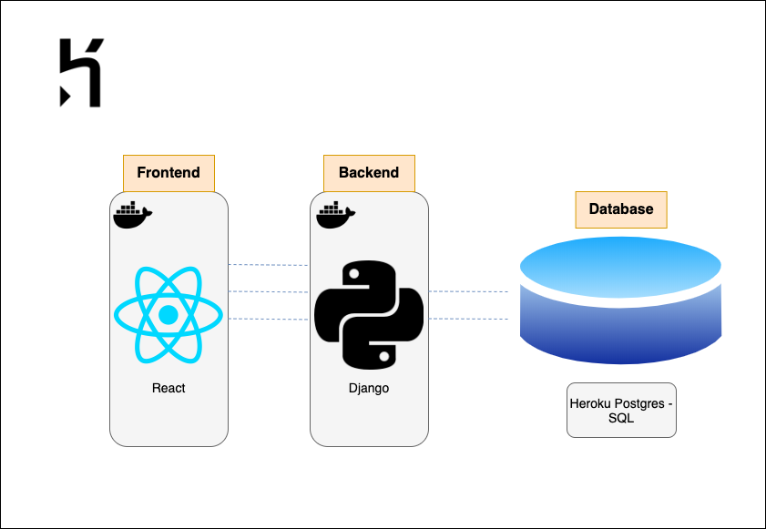
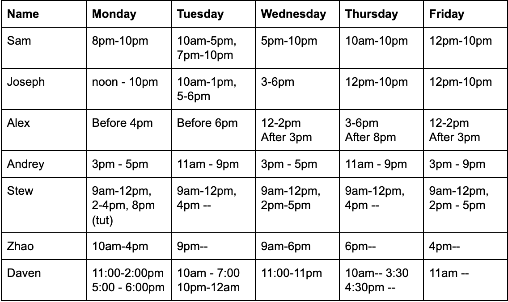
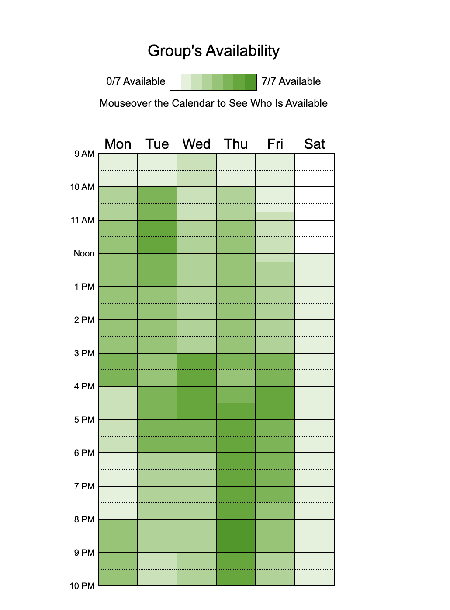

# StopGap Foundation / Team 21
> _Note:_ This document is meant to evolve throughout the planning phase of your project.   That is, it makes sense for you commit regularly to this file while working on the project (especially edits/additions/deletions to the _Highlights_ section). Most importantly, it is a reflection of all the planning you work you've done in the first iteration. 
 > **This document will serve as a master plan between your team, your partner and your TA.**

## Product Details
 
#### Q1: What are you planning to build?

We are creating a system that streamlines and centralizes StopGap’s ramp requests. Clients will be able to place ramp orders and keep track of their progress, and StopGap will be able to easily manage and fulfill these orders. This will be a web app where both clients and the StopGap team will have accounts. 

Many Toronto stores have entrance ways that are not aligned with the street level, creating a step that people with certain disabilities are not able to traverse. A business owner in charge of one of these stores who wants to order a ramp from StopGap for their entrance can use the web app to easily place an order and track its status. On the other side, the StopGap team can use the web app to organize the requests they do get, and communicate with their clients. For instance, if a photo submitted by a client is not clear enough to tell the height of the entranceway from, a StopGap employee can contact that client directly within the app, letting them know the issue and how to solve it.

#### Q2: Who are your target users?

There are two main groups of target users: StopGap clients and StopGap employees.
There are some personas for our target users:
Xtensio Profiles: https://csc301stopgap.xtensio.com/7g1672qs

For employee side:

Name: Jane

Age: 29

Job: StopGap employee

Personality: Hardworking, practical

Background: Jane is a employee who has been tasked to oversee the overall progress of ramp requests, she needs to deal with ramp requests everyday and she wants find a sufficient way to filter out all ramp requests and manage them

Client side:

Name: Edwin

Age: 40

Job: small coffee shop owner in downtown Toronto. 

Personality: kind, considerate, easy-going

Background: The entrance to Edwin’s stop has a 35cm step that prevents clients with wheelchairs from entering, he wants to use the app or website to book ramps easily so he can place an order for a custom ramp for the people using wheelchairs.

Name: Melissa

Age: 33

Job: The principal of an Elementary school in Mississauga 

Personality: responsible, organized

Background: She has already begun cooperation with StopGap’s school program to provide ramps for local businesses. Melissa wants to find an efficient  way to contact stopgap foundation and get the latest information as soon as possible  so she does not need to wait for the emails all the time  and know how to coordinate with the StopGap team about the next steps in the process. 

#### Q3: Why would your users choose your product? What are they using today to solve their problem/need?

Currently, clients submit their request to StopGap using a Google Form, after which the information gets transferred to a spreadsheet document for manual processing by the StopGap team. Communication between clients and StopGap is done through email.

With our app, clients will be able to create an account and request the ramp through that account. While the request process will be largely the same, the main benefits will be the ease of communication and availability of information to the client through the app. Clients will no longer need to email StopGap to request updates and wait for a response, as the up-to-date information related to their order will be displayed to them through their account. The instant messaging feature will also streamline communication, as compared to email which can be slow and cluttered.

The StopGap team will benefit from the data organization aspects of the app. Ramp request info will be vetted by the app for validity (ie. correct formats for addresses and postal codes) to reduce the amount of garbage data in the system. Team members will also be able to filter the data in the system to only display what they want to see, saving what could add up to hours of scrolling through data, looking for very specific information. This gives StopGap access to better analytic capabilities, increasing their ability to request funding and modify their programs based on historical data. Overall it will help StopGap accomplish their goal of increasing accessibility throughout the Toronto area, by increasing the efficiency in which they are able to create and deliver ramps.

#### Q4: How will you build it?

> Short (1-2 min' read max)
 * What is the technology stack? Specify any and all languages, frameworks, libraries, PaaS products or tools. 
 * How will you deploy the application?
 * Describe the architecture - what are the high level components or patterns you will use? Diagrams are useful here. 
 * Will you be using third party applications or APIs? If so, what are they?
 * What is your testing strategy?

 Tools temporarily decide:

      Front-end: React
      Backend/Server: Django REST Framework
      Database: Heroku/AWS
      Deploy: Docker + Heroku
Can we use Heroku locally and then use another technology to deploy to the partner?
Will Django and React work for deployment with Heroku?
      CI/CD: CircleCI (integrates well with Heroku)

Architecture and patterns:

Given a limited amount of time, our team decided to use a relatively simple architecture for the web application. Firstly, we will decouple the frontend (React) from the backend (Django REST Framework) and use the PostgreSQL managed by Heroku as our database of choice. The frontend and the backend will be deployed separately in two docker containers.

Third Party application/API (if any?):

At the moment, we believe we will not need to use any third-party applications/API’s

Testing strategy:

For each new function / API endpoint we will write for unit tests. The person responsible for reviewing the work should verify that the tests were written, while the person creating the pull request should make sure that these unit tests run successfully locally. In addition, all unit tests will be run on each merge to the master branch as part of the CI/CD pipeline.

#### Q5: What are the user stories that make up the MVP?

Main Goals (highlight the user stories which meet these, but we can show the other ones as well):

1. Able to request a ramp
2. Checkbox for subsidy
3. Checkbox for teacher
4. Detail how to take proper photos
5. Authentication 
6. Client account
7. Admin account
8. Organize and Display relevant information
9. Client will see only their request and its status
10. Admin can see all requests and all of their status’
11. Admin can filter info as needed
12. Admin can contact client directly through the app
13. Client can contact admin directly through the app

### Main user stories (followed by acceptance criteria after each story):

1. Able to request a ramp

Story: As a business owner, I want to be able to give my personal information to StopGap so we can proceed with the ramp transaction

Acceptance criteria: Allow them to access an in-app ramp request form which will outline what information they need to provide

2. Checkbox for subsidy

Story: As a business owner, I want to request a subsidy so that I can better afford a ramp 

Acceptance criteria: Allow clients to request a subsidy as part of the request process, and store this information with their request

3. Checkbox for teacher

Story: As a StopGap product manager, I want to identify if the client is a school or someone else, so that I can prioritize their needs appropriately

Acceptance criteria: Allow clients to specify if they are a school, and store this information with their request

4. Detail how to take proper photos

Story: As a StopGap product manager, I want to be able to capture measurements of the ramp so that I can better produce the ramp that the client is requesting

Acceptance criteria: Be able to store both the right and left side measurements of the required ramp for each request

Story: As a business owner, I want to be able to submit photos of my entranceway so that I can show the StopGap team what kind of ramp I need

Acceptance criteria: Able to upload photos to the app and store them alongside request information

Story: As a business owner, I want to be shown how to take ideal photos so that I can better communicate the specifications of the ramp I am requesting to the StopGap team

Acceptance criteria: Have a flow that walks the user through taking proper photos of their entranceway

5. Authentication

Story: As a StopGap project manager, I want to automatically validate client personal information to ensure that it is usable

Acceptance criteria: Validate certain fields to ensure the entries are formatted correctly (ie. postal codes)

6. Client account

Story: As a StopGap employee I want to be able to log in to the app as a StopGap user so I can access the features only available to users like me

Acceptance criteria: Allow admins to create other admin accounts with usernames and passwords, and allow users to sign in with those credentials

Story: As a business owner, I want to easily sign the liability waiver so that I can continue with the ramp ordering process

Acceptance criteria: Allow the signing of the liability waiver PDF within the app

7. Admin account

Story: As a StopGap client I want to be able to create and log in to an account so that I can use the StopGap services.

Acceptance criteria: Allow users to create and log in to client accounts with username and password, which will have separate permissions than admin accounts

8. Organize and Display relevant information

Story: As a StopGap employee, I want to be able to add notes to client information so that I can better organize

Acceptance criteria: Be able to add custom fields to the data associated with each request

Story: As a StopGap employee, I want to be able to tag ramp requests as being the next request to be built, or the next request to be painted, so I can better organize the fulfillment of the ramp requests.

Acceptance criteria: Allow custom tagging of ramp requests, and filtering of those tags

9. Client will see only their request and its status

Story: As a StopGap client I want to be able to see the progress of my ramp request, so that I can have an idea of how long until it is completed.

Acceptance criteria: Have the progress of the ramp request associated with this user’s account displayed to that account.

10. Admin can see all requests and all of their status’

Story: As a StopGap project manager, I want to easily see all the ramp information for each client in one place, so I can be better organized

Acceptance criteria: Be able to gather ramp request information from the database and display it on screen

Story: As a StopGap product manager, I want to be able to receive the photos sent by the client so that I can plan the ramp that they are requesting

Acceptance criteria: Able to view the photos associated with each request

Story: As a StopGap employee, I want to create a dashboard that will show me the  total number of ramp requests, how many in next build, how many ramps scheduled for next paint day, total revenue for selected time period and delivered ramps, so that I can be up-to-date on business affairs.

Acceptance criteria: Be able to create a dashboard that displays all the aforementioned data

11. Admin can filter info as needed

Story: As a StopGap employee, I want to be able to filter the information so that I can easily find groups of information that I need

Acceptance criteria: Be able to filter requests by various qualities (ie. build progress, delivered or not, is the ramp for a business or school, etc)

Story: As a StopGap employee, I want to be able to easily search for specific information so that I can easily find what I need

Acceptance criteria: Have a search bar that can allow searching through the data 

12. Admin can contact client directly through the app

Story: As a StopGap employee, I want to be able to communicate with clients so that I can inform them about their order and better serve their needs

Acceptance criteria: Have an instant messaging system between client and admin accounts

13. Client can contact admin directly through the app

Story: As a StopGap client I want to be able to communicate with the StopGap team so that I can tell them what I require from them.

Acceptance criteria: Have an instant messaging system between client and admin accounts

Additional Stories:

As a StopGap employee, I want to be able to use Quickbooks while using the app to manage the payment status of the company invoices.
Integrate with quickbooks to allow those features to be used on the app

----

## Process Details

#### Q6: What are the roles & responsibilities on the team?

Describe the different roles on the team and the responsibilities associated with each role. 
 * Roles should reflect the structure of your team and be appropriate for your project. Not necessarily one role to one team member.

List each team member and:
 * A description of their role(s) and responsibilities including the components they'll work on and non-software related work
 * 3 technical strengths and weaknesses each (e.g. languages, frameworks, libraries, development methodologies, etc.)

There will be a note taker for each meeting, who will record the topics and ideas that we discuss for future reference.

Development Branch Manager(s): Reviews merge requests from personal branches for quality and completion, and determines whether or not to merge into the development branch. There may be more than one development branch manager, and each one will be responsible for a certain field of code (ie. front-end, back-end).

Overall the roles and responsibilities of each member will be very flexible. We collectively will decide a list of tasks that we need to complete, and individual members will decide which tasks they feel comfortable completing. This free selection principle will also extend to tasks involving testing and quality insurance.

### Team-Member Strengths & Weaknesses

Stew:

   * General Strengths:
      1. Frontend (HTML, CSS, JavaScript)
      2. Backend (npm, Express.js, Flask, Mongoose)
      3. Some app dev experience (Native, React Native). Not super experienced but can quickly learn
      4. Some DevOps infrastructure experience (Docker, GCS, DigitalOcean).
      5. Quick to learn new technologies (flexible)
   * Weaknesses:
      1. No experience with CI/CD

Joseph:

   * General Strengths:
      1. In terms of tech, Java, Python, some experience with HTML and CSS
      2. Quick to learn new things so picking up new tech shouldn't be a big problem
      3. General communication, I like to constantly communicate my progress on anything we are working on
   * Weaknesses:
      1. Don’t have a lot of experience in a development environment 
      2. Not a lot of technical skills currently but will be able to learn at least

Zhao:

   * General Strengths:
      1. Web skills:  CSS, HTML, JavaScript, Node, Express.js, Ajax
      2. Database: Know both SQL and NoSQL, tools experienced:mySQL, mongoDB, not a lot about Firebase
      3. Backend: Java, C++, C#, C, Python, know how to write server calls
   * Weaknesses:
      1. Web skills: more familiar with vanilla javascript but not React or Angular  
      2. Database: knowledge is quite limited, only use a few database before
      3. Backend: not familiar with Python frameworks like Django or Flask

Andrey:

   * General Strengths:
      1. Backend: Spring Boot (Java), Django (Python), Golang (some basic knowledge)
      2. Cloud Infrastructure: AWS (have a developer associate certificate), a little knowledge of GCP
      3. Databases: DynamoDB, PostgreSQL, MongoDB
      4. CI/CD: Bash, Jenkins, Bamboo, AWS Deployment Suite (probably can learn how to use any CI/CD system fairly quickly)
      5. General Deployment: Docker, Docker Swarm, K8s
   * Weaknesses:
      1. Frontend (I have some experience from personal projects with React, HTML, CSS, JavaScript, but it will probably not be the best work)

Daven:

   * General Strengths:
      1. Learning a lot of web dev right now (currently in csc309 so everything should hopefully come together at the same time): css/html, react, javascript, flask
      2. Databases: PostgreSQL, MongoDB
      3. Quick to pick stuff up
      4. Python, Java, C
   * Weaknesses:
      1. Mobile app development

Alex:

   * General Strengths:
      1. Much experience in Python and Java
      2. Experience working in large groups for software development projects
      3. Quick to learn new skills
   * Weaknesses:
      1. Lack of experience with many technologies
      2. Minimal experience developing with servers
      3. Lack of experience with web development
      
Sam:

   * General Strengths:
      1. Languages: Python, Java, C, C++, Ruby, PHP
      2. Frameworks: Django, React
      3. Databases: MySQL, PostgreSQL
      4. Pretty quick to pick up new skills, comfortable switching between languages/tools
      5. Work experience, so pretty familiar with building something from the start as well as building onto existing work
   * Weaknesses:
      1. Not as comfortable with web dev, more of a backend developer
      2. Not as good of a communicator- work better in an environment where team touches base fairly frequently

#### Q7: What operational events will you have as a team?

### Availability

### Team Meeting Schedule

https://www.when2meet.com/?8701708-n87OW
Based on our team’s availability, we have decided that possible meeting times are Tuesday mornings, Wednesday afternoons, Thursday evenings, and Friday afternoons. We will have a minimum of one group meeting a week, to discuss current progress and plan out the next steps of development. The time of this meeting will vary between the aforementioned times, and is dependent on who is able and unable to attend at which times, and whose presence at the meeting is most important in relation to what we are discussing. This meeting will be seperate from the partner meetings.

### Partner Meeting Notes

First meeting with Partner (Debbie from StopGap Foundation):
Time: Monday January 27, 11am-12pm
Location: Google Hangouts
Discussion content: Arrange a regular meeting schedule; we also need to discuss many basic questions we need to know about this project from scratch, we list a set of questions for Debbie and ask her one by one.
Outcomes: We get most answers for the questions. The details for the answers and questions can be found here:
https://docs.google.com/document/d/1mHZyDL0u9HM0qHzUnC35di8V_AMbEL8AcP3gbPm93zo/edit#

Second meeting with Partner (Debbie from StopGap Foundation):
Time: The Initial Plan was Friday January 31, 4:30 pm, but it was canceled as Debbie had a personal emergency to deal with. We instead used email communication to discuss the topics we would have discussed in this meeting.
Discussion content: Mainly we need to talk over the preliminary requirements and the user stories as we have a tight schedule and afraid we may don't know which requirements we may be able to finish and which ones  are not. We also need some details for some requirements as they are not clear enough. We wanna make sure that we understand the specifications properly for the user stories/requirements.
Outcomes: Debbie sent some notes about the requirements and it gives sufficient details on each requirement. We have a much better understanding of each requirement and a clearer scope for the project. These can be found here:
https://docs.google.com/document/d/11NOJmLcD0P73gUsg7iPexuyGQPuj-OC823zlvbL9yQQ/edit

Future schedule for Partner Meeting:
Time: Possibly Sunday noon or Monday noon each week, depends on the availability of partner and each team member 
Location: Google Hangouts(online)

  
#### Q8: What artifacts will you use to self-organize?

##### Development Framework

We will use the **Kanban** method for delegating tasks. We chose this because it is a “low effort” option that allows team members to pick any task that works for them and that they have time to work on. Since we are students with varying schedules and workloads outside of CSC301, a task organization that reduces the amount of “in person” (or online voice) meetings needed and allows work to be done flexibly works best.

For the Kanban board, we will use a shared **Trello** board. Our columns will be:
 * **To Do**, containing tasks and user stories that have yet to be implemented. This will continuously be populated as more specific product specifications and feedback is given or as software bugs or potential design flaws become apparent.
 * **Pending**, tasks that are currently being developed on. Each member will assign the task to themselves and move the task to this list, commenting on the task with any important details (such as the feature branch). Ideally, members will only take on 1 or 2 tasks at a time, and so this list should have only up to 14 cards at any time.
 * **For Review**, for tasks that are implemented and need to be code-reviewed before being merged into the dev branch on GitHub. Ideally other members can comment on issues on the task, after which it can be moved back to pending while the feature is revised.
 * **Blocked**, for tasks that can not be completed or reviewed because it relies on another yet-to-be-completed task. Ideally the member working on the task will comment on the reason for it to be blocked.
 * **Done**, for tasks that are done and merged into dev. The list will be cleared upon a product deployment.

The Trello will also have separate columns for important links or resources, and for questions that we may have for our partner or TA.

Each task on Trello may also have labels signaling its importance: Urgent, High Priority, Low Priority, Bug Fix, and Question.

Tasks will be voluntarily assigned to team members who wish to do them. We have already prioritized the features that we want to include in our app, so we will first ensure all those features are completed or very close to completion before assigning other less important tasks. Members working on tasks will move the task on the board to the appropriate column when they have progressed with the completion of that task.

##### Keeping Accountability

**Requirement lists/To-Do lists**
We already have finished the requirement list during the partner meeting. It specify the details of the requirements for the project, which are just what we need to finish before the end of this term. We will use it to make TO-Do lists for the project and assign a subset of them to each team member in the future. We will also update the requirements list and To-Do lists after group meetings and partner meetings if they need to be changed.

**Discord/Messenger**
We use Discord and Messenger to communicate and deliver first hand information about the project. We use Messenger to send quick short messages; we use Discord for important message and voice communication. We will discuss jobs assignments, time schedule preference for each one during the meeting at Discord and Messenger.

##### Completing a Task

1. Commit to starting your task ASAP
   * I think this helps people to figure out: what the specific requirements of a task are, what they know and don’t know, what they might have trouble with, etc.
2. Identify areas of your task that might give you trouble
3. Ask for help at the next team meeting if you can’t figure it out by then
   * Gives us a chance to touch base, revisit tasks, discuss potential solutions, change requirements, etc.

##### Commit Frequency

As a team, we have decided that each member should have at least one commit per week. This is to ensure that everyone on the team is keeping at pace for deadlines. Commits themselves need not be extremely substantial. If for one week not much work was completed, we expect the next week to make up for that and so on.  

##### Git Flow
The Master branch will contain code that has been thoroughly vetted and is ready for deployment. Underneath that we will have the Development branch, which will be for work that is completed and approved, but has not been thoroughly reviewed. Each individual team member will have their own branch, where they will complete the tasks that they have been assigned. When they are ready to merge to the development branch, one team member will review the code for quality, and then decide whether or not to accept the merge request.

#### Q9: What are the rules regarding how your team works?

### General Expectations for Team Members (Working Culture)

* Regular communication: Checking Messenger/Discord once every 2-3 days
* Regular commits: Commit whenever a feature is complete + push to repo
* Keep task board up to date. (Trello)
* Communicate promptly + professionally with external people
* Support other group members, build confidence among the group
* Keep things friendly: we don’t need to be overly professional, but we also need to be respectful of each other

### Communication Methods

Our team plans to use two different communication channels for our project. For general group information such as meeting and deadline reminders, we plan on using Facebook Messenger. Given that all of us are active on Facebook, this will provide the greatest and fastest outreach to everyone in the group. For all work pertaining to the project we will use Discord. Discord allows us to have voice group meetings compared to other providers like Slack. In addition, like other providers, Discord has the same abilities of channel creation, inserting code snippets, and pinning important information. The current goal is to be in communication at least once every two to three days to keep the team up-to-date and in constant progress. 

For partner meetings, we have discussed that going forward Google Hangout calls and E-mail are the best way to reach our partner correspondent. Currently, we plan on scheduling at least one partner meeting per week, to keep them up to date on the current progress. 

### Meetings

Meetings are coordinated in advance to ensure that at least 5/7 members can meet. If anyone cannot attend a meeting, we develop meeting notes for them to review at a later time. Attending meetings is not only encouraged but expected. If a member has failed to meet this commitment repeatedly, we all agree to talk about attending future meetings. 

During meetings, our group plans on using Trello to establish deadlines and discuss TODOs. We plan on making meetings a collaborative discussion about how we will plan and implement various parts of our project. In addition, we hope meetings can give a wide overview of how everyone’s work is coming along, so no one member is left behind. For example if one sub-team is working on the front-end of the project, other members should have at the very least a general overview of their goals, progress and implementation.

### Resolving Conflicts

Scenario 1: A member is given a task to do by a deadline, and fails to complete that task.
   * Make deadlines that are a few days ahead of official dates, so that there is a period of time to recover from situations like this.
   * Have a conversation with the person unable to complete the task: find out why they were unable to finish and take steps to make sure they are able to complete future tasks 
   * Encourage members to speak up early if they are having issues to avoid this situation happening in the first place. We want to create an inclusive group that is willing to help each other out in times like this. Was the team member inexperienced or overwhelmed with the project? Did they have a lot of stuff on their plate in terms of the task or other courses? It's important to find out the root cause early on. 

Scenario 2: Two members don’t agree on how a feature should be implemented
   * Have a group meeting where both members present their cases, and the group can collectively decide which member’s method to go with.
   * Judge both individual skills of each member to see who has more experience in the implementation. Preference is given to someone with experience. 

Scenario 3: A group member hasn’t responded to any attempts to contact them in two days.
   * As a team, we will use Facebook Messenger / Discord to contact group members on the 3rd day and remind them about our team rules. 
   * If by the following tutorial day (Monday) we don’t receive a response or any indication that they’ve seen our message, we talk to our TA. 
   * If we haven’t received a response and talked to our TA about the situation, we immediately divvy up the work of the member and move forward without them for the time being. It's important that as a team we don't lose our stride. We're also understanding of situations where a member is gone for a period of time. When the member does have time to reach out to us and we've completed some work, we will inform them of changes and incorporate them back in as usual. 

----
### Highlights

1.) One of the key decisions that we decided over revolved around the scope of our project. Initially, we were unsure of whether we were tasked with the learning management system or the ramp requests portion of StopGap's proposal. During our first meeting with our partner, we took on the responsibility of both components. It seemed do-able enough given the size of our group and the importance of each to StopGap. As time went on through meetings and planning discussions, we quickly discovered that both components were possibly too large of a task and the scope of our project was too large. Also, after discussions with our TA and partner, we came to the decision that our main focus should be StopGap's ramp request component. The ramp request component was clearly the more fulfilling project for StopGap given the current implementation was cumbersome and not fit for the large intake StopGap is expecting in the near future. As a team we also agreed that our skills would better translate for a more complete project if we focused on ramp requests. Our team has a strong background in databases (SQL, MongoDB) and web development (React, RESTful APIs). 

2.) One of the key decisions for our group was about choosing our members. Initially, we only had 6 group members and we considered having one more member. Our group had more than one person interested in joining our group and we were considering whether to have a group of 7, or 8. After a long discussion, we decided to choose Daven as our last group member as he has the skills and personalities we sought from a team member. Also, we decided to keep a team of 7 instead of 8. The reason for this is that it's already difficult to manage a team of 7 and assign a job to everybody. In a team of 8, although everyone may be assigned less work, it will be harder to manage in terms to communication and assigning tasks.

3.) Another key decision came in terms of our **tech stack**. At first we waited to have a partner meeting and decide our scope before deciding a tech stack (to see if we needed to develop an app vs a website, or to see how complex our product would be to develop). Eventually, we decided on a web app built with a React frontend and a Django backend with a PostgresSQL database, all of which deployed on Heroku using CircleCI integration. We decided this during a tutorial meeting where we discussed what technologies we were familiar with. A few team members were already familiar with React, so we used that for the frontend. Similarly for Django and PostgresSQL. Furthermore, when deciding how we were going to host our site, we were initially unsure if Heroku or AWS would be a better solution. We settled on Heroku because 1) it could do the basics that we needed it to do, AWS would be overkill, and 2) AWS is much more complex to work with and would cost us more development time for us to configure it. Overall, most of our tech stack decisions were based on what was the **easiest** for us to work with. This is a priority since we only have 2 months to develop our product and so we need to use our limited development time as efficiently as possible - spending time learning new tech frameworks would not be efficient. 

4.) When choosing our project, our team took the time to look through each partner proposal and collectively decide. We consider it a key highlight because it highlighted our decision-making process as a team. Each member constructed their own list of favorite proposals and their overall reason for choosing it. The reasons varied from interesting proposal to easy implementation. StopGap wasn't everyone's first choice but after our team meetings it became our collective choice. Through debates and discussions, we talked over our skill set and how it would fair in each proposal. Also, it was chosen because it was on the majority of our team's list and it was the most fitting option. Because of this process, our team is satisfied with our project and no one finds working on the project a bore. 